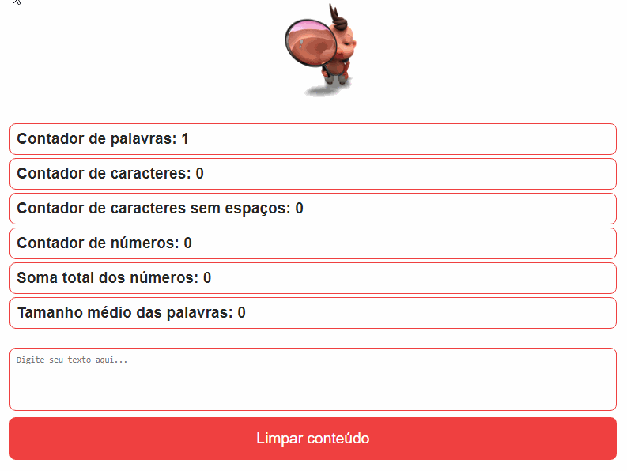

# Laboratoria - Bootcamp 2024

[](https://www.laboratoria.la/br)

## Projeto 01 - Analisador de Texto

<div align="center">


[](https://elizabetefabri.github.io/SAP012-text-analyzer/)

</div>

## 1. Considerações gerais

## 2. Preâmbulo

Um analisador de texto é uma aplicação para extrair informações úteis de um texto utilizando diversas técnicas, como o processamento de linguagem natural (PLN),aprendizado de máquina (ML) e análise estatística. Essas aplicações podem fornecer uma variedade de métricas que oferecem informações básicas sobre o comprimento e a estrutura do texto, como contagem de palavras, contagem de caracteres, contagem de sentenças e contagem de parágrafos. Outras métricas incluem análise de sentimentos, que utiliza técnicas de PLN para determinar o tom geral positivo, negativo ou neutro do texto, e análise de legibilidade, que utiliza algoritmos para avaliar a complexidade e legibilidade do texto.

Em geral, as aplicações de análise de texto fornecem informações valiosas e métricas sobre os textos que podem ajudar os usuários a tomar decisões informadas e tirar conclusões significativas. Por meio do uso dessas ferramentas de análise, os usuários podem obter uma compreensão mais profunda dos textos.

## 3. Resumo do projeto

Neste projeto, desenvolvido com fins em aprendizado, foi feito uma aplicação que capacita os usuários a realizar análises de textos diretamente no navegador. Os usuários têm a liberdade de inserir um texto de sua preferência, e a aplicação disponibiliza diversos indicadores e métricas específicas. Essas métricas englobam diferentes aspectos, incluindo contagem de caracteres, letras, números e outras estatísticas relevantes.

### Tecnologias Utilizadas
O Analisador de Texto foi desenvolvido utilizando as seguintes tecnologias:

- **HTML**: Utilizado para estruturar a interface da aplicação.
- **CSS**: Responsável pelo estilo e layout visual da aplicação.
- **JavaScript**: Implementação das funcionalidades interativas e lógica de análise de texto.

## 4. Funcionalidades

- **Contagem de palavras**: a aplicação é capaz de contar o número de
  palavras no texto de entrada e mostrar essa contagem para a usuária.
- **Contagem de caracteres**: a aplicação é capaz de contar o número de
  caracteres no texto de entrada, incluindo espaços e sinais de
  pontuação, e mostra essa contagem para a usuária.
- **Contagem de caracteres excluindo espaços e sinais de pontuação**:
  a aplicação é capaz de contar o número de caracteres no texto de
  entrada, excluindo espaços e sinais de pontuação, e mostra essa contagem
  para a usuária.
- **Contagem de números**: a aplicação é capaz de contar quantos números há no
  texto de entrada e mostra essa contagem para a usuária.
- **Soma total dos números**: a aplicação é capaz de somar todos os números que
  estão no texto de entrada e mostra o resultado para a usuária.
- **Comprimento médio das palavras**: a aplicação é capaz de calcular o
  comprimento médio das palavras no texto de entrada e mostra esse valor para a usuária.

## 5. Implementação no Github Pages

- Acessar o projeto no Github
- Settings -> Pages
- Selecione o branch "pg-main" (Save)

## Instalação do meu projeto

- Acessar botão code no Github
- Copiar a URL de acesso ao clone SSH ou HTPPS
- Clonar o projeto na sua máquina local:

```
# Clone o repositório para a sua máquina local
git clone https://github.com/elizabetefabri/SAP012-text-analyzer.git

# Após o clone, navegue até o diretório do projeto
cd SAP012-text-analyzer

# Instale as dependências do projeto
npm install

# Execute a verificação de segurança com npm audit
npm audit

# Instale o Playwright, uma biblioteca em Node.js para automação de testes em navegadores
npx playwright install chromium --with-deps

```
